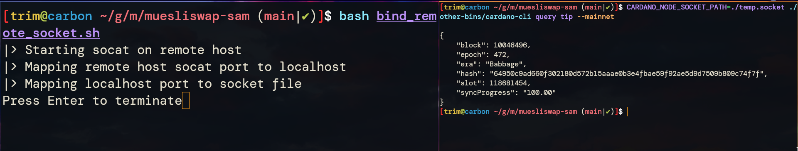

# Comprehensive Review on SAM Tool's Limitations and Strategic Solutions

## Introduction
The Muesliswap SAM tool aims to revolutionize how distributed systems communicate by employing SSH for encrypted connections and `socat` for effective socket forwarding. This examination explores the tool's framework, interactions, `socat`'s pivotal role, challenges encountered, and solutions to enhance functionality.

## Operational Insights
SAM's design facilitates a seamless client-server interaction, utilizing SSH and `socat` for secure and efficient data relay. This operational model simplifies remote resource engagement, offering a semblance of local access to server-hosted services.

## Command-Line Interface (CLI) Engagement
At SAM's core is its CLI-based operation, necessitating users to prepare both client and server environments for `socat`-driven socket forwarding. This approach underscores the need for correct installation and configuration to achieve desired outcomes.

## The Essential Role of `Socat`
`Socat` emerges as a linchpin in SAM's architecture, adept at bridging data transfer gaps between diverse endpoints. It crafts a duplex communication stream, essentially mirroring socket connections across network boundaries.

## Identified Challenges and Remediations
- **Dependency Management**: The prerequisite for `socat` across environments may introduce setup hurdles. **Remedy**: A setup assistant script could automate dependency verification and installation, streamlining initial configurations.
- **Error Diagnostics**: Enhanced error handling and detailed logs could vastly improve problem-solving efficiency and user experience. **Remedy**: Implementing advanced error tracking and comprehensive logging mechanisms could provide immediate, actionable insights.
- **Educational Resources**: The utility and adoption of SAM can benefit from expanded documentation, offering in-depth guidance on advanced functionalities and troubleshooting. **Remedy**: Enriching the documentation with detailed use cases, troubleshooting guides, and best practices would empower users to leverage SAM more effectively.

## Conclusion
The Muesliswap SAM tool, with its innovative approach to remote socket communication, holds great promise for distributed network management. Addressing its current limitations with targeted solutions not only enhances its practicality but also positions it as an indispensable resource for network administrators and developers alike. Continuous refinement and community input are vital for its evolution into a fully realized, everyday utility.

# MVP Functionality:

## Configuration
Create a new `ENV` file (see `ENV_TEMPLATE` as a reference)

## Usage
Run the following command from inside the root of the repository: `bash ./bind_remote_socket.sh`
After that a new file according to `CLIENT_SOCKET_PATH` should be created that can be used for communication with the node (see screenshot below)



This channel can be used for one-off communication with the underlying node.
Due to the issue discussed below however with each node interaction this socket has to be reopened.

## Functionality
Although not fully production ready, this MVP shows that the underlying idea can work without issues, as can be seen by the fact that the CLI is successfull in communication with a remote Node.
To have a finished product, the issue of manual intervention to restart the script still has to be addressed, however there should be no issue with that.

# Comprehensive Script Analysis: Facilitating Seamless Socket Communication

## Introduction
The `bind_remote_socket.sh` Bash script facilitates secure, two-way communication between local and remote systems using `socat` and SSH tunneling, streamlining the process of socket forwarding and tunnel creation.


## Breakdown of Functional Steps

### 1. Environment Configuration
Initiates by sourcing an external configuration file, `ENV`, which outlines essential variables, ensuring the script operates within the defined parameters.

```bash
source ENV
```

### 2. Dependency Check
Verifies the installation of `socat` on both local and remote machines, critical for the script's operation, preventing execution failure due to missing dependencies.

```bash
# Check if socat is installed
if ! which socat &> /dev/null; then
    echo "SOCAT is not installed!!"
    echo "Please install socat first, to use this script"
    exit 1
fi

if ! ssh "$SERVER_USER@$SERVER_ADDRESS" which socat &> /dev/null; then
    echo "SOCAT is not installed on remote host!!"
    echo "Please install socat first on the remote, to use this script"
    exit 1
fi
```

### 3. Remote `socat` Mapping
Activates `socat` on the remote host to bridge a UNIX socket with a TCP port, setting the foundation for incoming connection listening.

```bash
function map_remote() {
  echo "|> Starting socat on remote host"
  ssh "$SERVER_USER@$SERVER_ADDRESS" \
      "sudo socat \"UNIX-CONNECT:$SERVER_SOCKET_PATH\" \
            \"TCP-LISTEN:$SERVER_PORT,fork,reuseaddr\""
}
```

### 4. Local to Remote Port Forwarding
Establishes an SSH tunnel for forwarding local ports to the remote `socat` port, enabling direct access to the remote socket from the local machine.

```bash
function connect_remote_client() {
  echo "|> Mapping remote host socat port to localhost"
  ssh -L "$CLIENT_PORT:localhost:$SERVER_PORT" \
      -N -T "$SERVER_USER@$SERVER_ADDRESS"
}
```

### 5. Local `socat` Mapping
Maps the SSH-forwarded TCP port to a UNIX socket on the local system, allowing applications to interact with the remote socket seamlessly.

```bash
function map_client() {
  echo "|> Mapping localhost port to socket file"
  socat -d "TCP:localhost:$CLIENT_PORT" \
        "UNIX-LISTEN:$CLIENT_SOCKET_PATH,fork"
}
```

### 6. Process Management
Executes the socket mapping and port forwarding in the background, tracking their process IDs for subsequent management, with strategic delays to ensure stability.

```bash
# Step 1: Start socat on remote and map to port
map_remote &
PID_MAP_REMOTE=$!
sleep 3

# Step 2: Map socket port to local machine
connect_remote_client &
PID_CONNECT_REMOTE_CLIENT=$!
sleep 3

# Step 3: Map port to socket on local machine
map_client &
PID_MAP_CLIENT=$!
sleep 1
```

### 7. User Interaction for Cleanup
Pauses for user input, offering control over when to terminate the established connections and clean up resources.

```bash
read -rp "Press Enter to terminate" </dev/tty
```

### 8. Cleanup
Safely terminates all related `socat` and SSH processes on both systems, ensuring no residual resources are left behind.

```bash
echo "|> Cleaning up"

# Kill everything from ssh and socat on the remote host
ssh "$SERVER_USER@$SERVER_ADDRESS" \
    "sudo kill \$(sudo lsof -i :$SERVER_PORT | tail --lines +2 | awk '/socat/{ print \$2 }')"
ssh "$SERVER_USER@$SERVER_ADDRESS" \
    "sudo kill \$(sudo lsof -i :$SERVER_PORT | tail --lines +2 | awk '/ssh/{ print \$2 }')"

# Kill everything from ssh and socat on the local host
kill $(lsof -i :$CLIENT_PORT | tail --lines +2 | awk '/socat/{ print $2 }')
kill $(lsof -i :$CLIENT_PORT | tail --lines +2 | awk '/ssh/{ print $2 }')
```

## Conclusion
Through strategic utilization of `socat` and SSH, this script adeptly establishes a secure and efficient bridge for socket communication, embodying a sophisticated solution for remote system interaction.


# Enhanced Analysis of Socat's Limitations and Strategic Solutions

## Introduction
This segment delves into a pivotal challenge within the SAM framework, underscoring `socat`'s limitations in managing new connections. Despite this, SAM's existing partial functionality underscores its viability as a Minimum Viable Product (MVP), showcasing both feasibility and inherent usability constraints.

## New Connections Limitation
A notable limitation arises from `socat`'s single connection initiation per mirrored socket file, contrasting sharply with the CLI's approach of establishing new connections for each interaction. This discrepancy can cause operational inefficiencies, where the node fails to process multiple commands sequentially, potentially leading to unresponsive behavior or ignored commands post-initial interaction.

## Strategic Solutions for Connection Handling
To mitigate these connection handling challenges, two primary solutions are proposed:
- **Reconfiguring Socat for Reconnection**: Modifying `socat` settings to facilitate automatic reconnection after a connection drop ensures sustained communication, addressing the continuity issue.
- **Development of a Custom Script**: Crafting a bespoke script to interact directly with the node's socket circumvents `socat`'s limitations. This script would explicitly handle connection lifecycles, initiating new connections per interaction, thereby aligning more closely with operational expectations.

These strategies aim to rectify the limitations inherent in `socat`'s current implementation, thereby enhancing SAM's capacity to facilitate robust socket communication across distributed networks.

## Conclusion
The MVP stage of the Muesliswap SAM tool demonstrates functional viability despite identifiable limitations requiring resolution. The outlined solutions not only propose a pathway to overcoming these hurdles but also reflect a proactive approach towards refining SAM for everyday utility.
